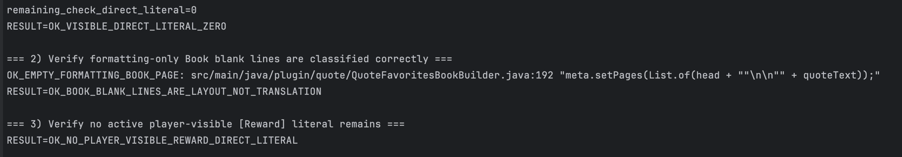

# TreasureRun — Treasure Hunt Mini-Game Plugin for Spigot 1.20.1

[](https://github.com/flowmari/TreasureRun/actions/workflows/ci.yml)
[](https://github.com/flowmari/TreasureRun/actions/workflows/i18n-ci.yml)

> **A Minecraft Spigot mini-game plugin focused on maintainable Java architecture, 19-language i18n, CI quality gates, Docker-based validation, MySQL persistence, and effect-rich gameplay.**

TreasureRun is a custom treasure-hunt mini-game plugin for Minecraft Spigot 1.20.1.  

TreasureRun separates internal game logic from player-facing display text, making the plugin easier to localize, audit, and maintain across 19 language packs.
Players search for treasure chests within a time limit, earn scores, trigger visual/audio effects, and interact with multilingual in-game UI.

This repository is designed as a portfolio project that demonstrates not only gameplay implementation, but also **engineering discipline: internationalization, quality control, runtime verification, and maintainable plugin design**.

---

## [日本語](#japanese) | [English](#english)

---

<a id="japanese"></a>

## 日本語

### これは何？

**TreasureRun** は、Minecraft Spigot 1.20.1 向けの宝探しミニゲームプラグインです。

プレイヤーは制限時間内に宝箱を探し、スコアを獲得し、ランキングや演出付きの結果表示を体験できます。

このプロジェクトでは、単なるゲーム機能だけでなく、以下のような **実務で評価されやすい設計・品質管理** を重視しています。

- Javaコード内のユーザー向け直書き文字列を削減
- 19言語の `languages/*.yml` によるi18n管理
- 翻訳キー欠落、YAML構文、重複キーをCIで検査
- Docker上のSpigotサーバーで実行検証
- MySQLによるスコア・ログ永続化
- エフェクト、ランキング、言語設定、ゲーム進行を分離して管理

---

### 主な機能

#### ゲームプレイ

- 宝箱探索ミニゲーム
- Easy / Normal / Hard の難易度
- 制限時間つきのゲーム進行
- 宝箱回収数、タイム、スコア、ランクの表示
- 結果メッセージとゲーム内演出

#### 視覚・音響演出

- UFO caravan / Wandering Trader / Trader Llama 演出
- Moving Safety Zone
- パーティクル、サウンド、床エフェクト
- ランキング報酬演出
- 宝箱接近時の音響フィードバック

#### i18n / 多言語対応

- 19言語の `languages/*.yml`
- プレイヤーごとの言語設定
- `/lang` による言語選択
- GUI上の言語表示
- Javaコードは翻訳キーを参照し、文言はYAML側に外部化

対応言語例：

```text
ja, en, de, fr, it, sv, es, fi, nl, ru, ko, zh_tw, pt, hi, la, lzh, is, sa, asl_gloss
```

---

<!-- TREASURERUN_DOCS_SPLIT_JA_START -->
### 使い方・設計ドキュメント

README本体は概要を短く保ち、詳細な使い方・コマンド仕様・設計意図は外部ドキュメントに分離しています。

| Document | 内容 |
|---|---|
| [`docs/COMMANDS.md`](docs/COMMANDS.md) | プレイヤー向け・OP向けコマンド、権限、alias、サブコマンド |
| [`docs/ARCHITECTURE.md`](docs/ARCHITECTURE.md) | Module / Layer構成、Mermaid構成図、Tech Highlights、Runtime Flow |

#### Quick Start / Local Runtime

```bash
./gradlew clean build
docker compose up -d
cp build/libs/TreasureRun-1.0-SNAPSHOT-all.jar spigot-data/plugins/
docker restart minecraft_spigot
docker logs -f minecraft_spigot
```

#### Tech Highlights

| Area | このプロジェクトで示していること |
|---|---|
| Concurrency / Scheduler | Bukkit schedulerによるゲーム進行、演出、遅延実行、cleanup |
| Security / Permissions | `plugin.yml` permissions、OP限定コマンド、debug gate |
| Performance / Runtime Safety | 生成ブロック・entity・taskのcleanup、演出のbounded execution |
| Resilience / Fallback / Reload | i18n fallback chain、JAR同梱language filesからの再生成、`/treasureReload` |

> TreasureRun は Spigot plugin であり REST API service ではないため、Swagger/OpenAPI は使わず、`docs/COMMANDS.md` と `docs/ARCHITECTURE.md` に外部化しています。

---
<!-- TREASURERUN_DOCS_SPLIT_JA_END -->

### CI品質ゲート

GitHub Actionsで以下を検証しています。

- 19言語YAMLの構文チェック
- 必須キーの存在チェック
- Javaコードから参照されるi18nキーの存在チェック
- 重複キーの検出
- Gradleビルド

これにより、翻訳キーの欠落やYAMLの構文エラーがある状態で変更が混入しにくい構成にしています。

---

### 技術スタック

| Category | Technology |
|---|---|
| Language | Java 17 |
| Game Server | Spigot 1.20.1 |
| Build | Gradle / ShadowJar |
| Database | MySQL 8 |
| Runtime Validation | Docker / Docker Compose |
| CI | GitHub Actions |
| i18n | YAML language packs |
| IDE | IntelliJ IDEA |

---

### アーキテクチャ概要

```text
TreasureRun
├── Game Core
│   ├── TreasureRunMultiChestPlugin
│   ├── GameStageManager
│   ├── TreasureChestManager
│   └── TreasureRunStartCommand
│
├── Gameplay Effects
│   ├── MovingSafetyZoneTask
│   ├── UfoCaravanController
│   ├── RankRewardManager
│   └── ChestProximitySoundService
│
├── i18n
│   ├── I18n
│   ├── LanguagesYamlStore
│   ├── LanguageSelectGui
│   └── src/main/resources/languages/*.yml
│
├── Ranking / Persistence
│   ├── RealtimeRankTicker
│   ├── SeasonRepository
│   ├── SeasonScoreRepository
│   └── MySQL
│
└── CI / Quality Gates
    ├── scripts/check_i18n_yaml_syntax.py
    ├── scripts/check_i18n_required_keys.py
    ├── scripts/check_i18n_referenced_keys.py
    └── scripts/check_i18n_duplicate_keys.py
```

---

### i18n品質検証

このプロジェクトでは、翻訳ファイルを「置いて終わり」ではなく、CIで検証しています。

代表的な検証結果：

```text
RESULT=OK_YAML_SYNTAX
RESULT=OK_REQUIRED_KEYS
RESULT=OK_REFERENCED_KEYS
RESULT=OK_DUPLICATE_KEYS
RESULT=OK_BUILD
```



サーバー側でも、古い `plugins/TreasureRun/languages` が優先されないように退避し、最新JAR同梱のlanguageファイルから再生成されることを確認しました。

```text
[Lang] copied from jar: languages/en.yml
[Lang] copied from jar: languages/ja.yml
...
[Lang] copied from jar: languages/asl_gloss.yml
```

最終的にDocker上のSpigotサーバーでも19言語が有効化されていることを確認しています。

```text
Server languages count: 19
minecraft_spigot: healthy
```

---

### ビルド方法

```bash
./gradlew clean shadowJar
```

生成されるJAR：

```text
build/libs/TreasureRun-1.0-SNAPSHOT-all.jar
```

---

### ローカル実行環境

このプロジェクトは、Docker上のSpigotサーバーで検証しています。

```bash
docker compose up -d
```

プラグインJARをサーバーへ配置し、コンテナを再起動して確認します。

```bash
docker cp build/libs/TreasureRun-1.0-SNAPSHOT-all.jar minecraft_spigot:/data/plugins/
docker restart minecraft_spigot
docker logs --tail=200 minecraft_spigot
```

---

### 採用担当者向けの見どころ

このリポジトリでは、以下の実装力を確認できます。

- Spigot APIを使ったゲームシステム実装
- Javaでの状態管理、イベント処理、コマンド実装
- MySQL連携によるスコア永続化
- Dockerを使ったローカル実行検証
- 19言語i18nの設計と運用
- GitHub ActionsによるCI品質ゲート
- バグ修正、検証、再発防止まで含めた開発プロセス

---

<a id="english"></a>

<div lang="en" translate="no">

## English

### What is TreasureRun?

**TreasureRun** is a custom Minecraft mini-game plugin for Spigot 1.20.1.

Players search for treasure chests within a time limit, earn scores, experience visual/audio effects, and view ranking-related feedback in-game.

This project is designed not only as a playable mini-game, but also as a portfolio project demonstrating **maintainable Java plugin architecture, 19-language internationalization, CI quality gates, Docker-based runtime validation, and MySQL-backed persistence**.

---

### Project Focus

This project emphasizes engineering practices that are important in real-world software development:

- Reducing hardcoded player-facing strings in Java
- Externalizing UI/game messages into YAML language packs
- Supporting 19 language files
- Detecting missing i18n keys through CI
- Detecting YAML syntax errors before merge
- Validating the plugin on a Docker-based Spigot server
- Separating gameplay, effects, ranking, language, and persistence responsibilities

---

### Key Features

#### Gameplay

- Treasure-hunt mini-game
- Easy / Normal / Hard difficulty modes
- Time-limited game flow
- Chest collection, time, score, and rank display
- Result messages and in-game effects

#### Visual and Audio Effects

- UFO caravan with Wandering Trader and Trader Llamas
- Moving Safety Zone
- Particle effects, sound effects, and dynamic floor visuals
- Ranking reward effects
- Chest proximity sound feedback

#### Internationalization

- 19 YAML language packs
- Per-player language selection
- `/lang` command and language selection GUI
- Java code references i18n keys instead of hardcoded messages
- Player-facing messages are externalized into `src/main/resources/languages/*.yml`

Supported language packs include:

```text
ja, en, de, fr, it, sv, es, fi, nl, ru, ko, zh_tw, pt, hi, la, lzh, is, sa, asl_gloss
```

---

<!-- TREASURERUN_DOCS_SPLIT_EN_START -->
### Usage and Design Documentation

The README is intentionally kept as a concise project overview. Detailed usage, command behavior, and architectural design are externalized into dedicated documents.

| Document | Content |
|---|---|
| [`docs/COMMANDS.md`](docs/COMMANDS.md) | Player/admin commands, permissions, aliases, and subcommands |
| [`docs/ARCHITECTURE.md`](docs/ARCHITECTURE.md) | Module/layer structure, Mermaid architecture diagram, tech highlights, and runtime flow |

#### Quick Start / Local Runtime

```bash
./gradlew clean build
docker compose up -d
cp build/libs/TreasureRun-1.0-SNAPSHOT-all.jar spigot-data/plugins/
docker restart minecraft_spigot
docker logs -f minecraft_spigot
```

#### Tech Highlights

| Area | What this project demonstrates |
|---|---|
| Concurrency / Scheduler | Bukkit scheduler usage for gameplay flow, effects, delayed execution, and cleanup |
| Security / Permissions | `plugin.yml` permissions, operator-only commands, and debug gating |
| Performance / Runtime Safety | Cleanup of generated blocks, entities, tasks, and bounded visual/audio effects |
| Resilience / Fallback / Reload | i18n fallback chain, regeneration from bundled language files, and `/treasureReload` |

> TreasureRun is a Spigot plugin, not a REST API service. Swagger/OpenAPI is intentionally not used; command and architecture documentation are externalized instead.

---
<!-- TREASURERUN_DOCS_SPLIT_EN_END -->

### CI Quality Gates

GitHub Actions validates:

- YAML syntax across language files
- Required i18n keys
- Java-referenced i18n keys
- Duplicate YAML keys
- Gradle build

This prevents incomplete translations, broken YAML, and missing keys from entering the main branch unnoticed.

---

### Tech Stack

| Category | Technology |
|---|---|
| Language | Java 17 |
| Game Server | Spigot 1.20.1 |
| Build Tool | Gradle / ShadowJar |
| Database | MySQL 8 |
| Runtime Validation | Docker / Docker Compose |
| CI | GitHub Actions |
| i18n | YAML language packs |
| IDE | IntelliJ IDEA |

---

### Architecture Overview

```text
TreasureRun
├── Game Core
│   ├── TreasureRunMultiChestPlugin
│   ├── GameStageManager
│   ├── TreasureChestManager
│   └── TreasureRunStartCommand
│
├── Gameplay Effects
│   ├── MovingSafetyZoneTask
│   ├── UfoCaravanController
│   ├── RankRewardManager
│   └── ChestProximitySoundService
│
├── i18n
│   ├── I18n
│   ├── LanguagesYamlStore
│   ├── LanguageSelectGui
│   └── src/main/resources/languages/*.yml
│
├── Ranking / Persistence
│   ├── RealtimeRankTicker
│   ├── SeasonRepository
│   ├── SeasonScoreRepository
│   └── MySQL
│
└── CI / Quality Gates
    ├── scripts/check_i18n_yaml_syntax.py
    ├── scripts/check_i18n_required_keys.py
    ├── scripts/check_i18n_referenced_keys.py
    └── scripts/check_i18n_duplicate_keys.py
```

---

### i18n Quality Verification

The i18n system is not just a set of translation files. It is validated through CI.

Expected verification output:

```text
RESULT=OK_YAML_SYNTAX
RESULT=OK_REQUIRED_KEYS
RESULT=OK_REFERENCED_KEYS
RESULT=OK_DUPLICATE_KEYS
RESULT=OK_BUILD
```


The Docker-based Spigot runtime was also checked to ensure that old server-side language files do not override the latest bundled language files.

```text
[Lang] copied from jar: languages/en.yml
[Lang] copied from jar: languages/ja.yml
...
[Lang] copied from jar: languages/asl_gloss.yml
```

Final server-side confirmation:

```text
Server languages count: 19
minecraft_spigot: healthy
```

---

### Build

```bash
./gradlew clean shadowJar
```

Output:

```text
build/libs/TreasureRun-1.0-SNAPSHOT-all.jar
```

---

### Local Runtime Validation

The plugin is tested on a Docker-based Spigot server.

```bash
docker compose up -d
```

Deploy the plugin JAR:

```bash
docker cp build/libs/TreasureRun-1.0-SNAPSHOT-all.jar minecraft_spigot:/data/plugins/
docker restart minecraft_spigot
docker logs --tail=200 minecraft_spigot
```

---

### Why This Project Matters

TreasureRun demonstrates practical backend/plugin engineering skills beyond a simple tutorial project:

- Java plugin development with Spigot API
- Event-driven gameplay implementation
- Runtime state management
- MySQL-backed persistence
- Docker-based local verification
- 19-language i18n architecture
- CI-based quality control
- Debugging, validation, and maintainability-focused development

</div>

---

## Repository Status

- CI: passing
- i18n validation: passing
- Supported languages: 19
- Runtime server validation: confirmed with Docker-based Spigot environment

---

## License

This project is currently a personal portfolio project.

### Event-Level Localization for Engine-Generated Messages

TreasureRun localizes not only plugin-owned UI text, but also selected Minecraft/Spigot engine-generated messages through Bukkit event listeners.

Vanilla death messages are intercepted via `PlayerDeathEvent`, classified into stable i18n keys such as `gameplay.death.firework`, `gameplay.death.explosion`, and `gameplay.death.generic`, resolved against the player’s selected language, and rendered through the same YAML-based i18n pipeline used by GUI, books, chat, BossBar, ActionBar, and ranking messages.

This keeps all supported languages parallel instead of treating English as the only default source and other languages as secondary translations.

### Bukkit Event-Layer System Message Localization

TreasureRun extends its YAML-based i18n pipeline beyond plugin-owned UI text into selected Minecraft/Spigot engine-generated system messages.

The plugin intercepts Bukkit event-layer messages such as player join, quit, kick, advancement announcements, server list MOTD, unknown commands, no-permission command feedback, and death messages. Each message is resolved through the player's selected language and the same `languages/<lang>.yml` files used by GUI, books, chat, BossBar, ActionBar, rankings, and gameplay results.

For advancement announcements, TreasureRun suppresses the vanilla global announcement and rebroadcasts a localized message per online receiver. This demonstrates a dynamic localization pipeline where the same server event can be rendered differently for different players depending on their stored language preference.

Scope note: client-side, authentication, network, and pre-login errors are outside the Bukkit plugin layer, so TreasureRun describes this feature as Bukkit event-layer system message localization rather than full client/protocol localization.


### MySQL Ranking Persistence

TreasureRun stores weekly and all-time ranking data in MySQL.

The database schema is documented here:

- [`docs/sql/V1__create_ranking_tables.sql`](docs/sql/V1__create_ranking_tables.sql)

Runtime verification is documented here:

- [`docs/verification/ranking-persistence.md`](docs/verification/ranking-persistence.md)

This feature demonstrates Java repository-layer persistence, MySQL schema design, weekly/all-time ranking separation, foreign key integrity, unique-key based upsert design, selected-language tracking, and Docker-based runtime verification.
